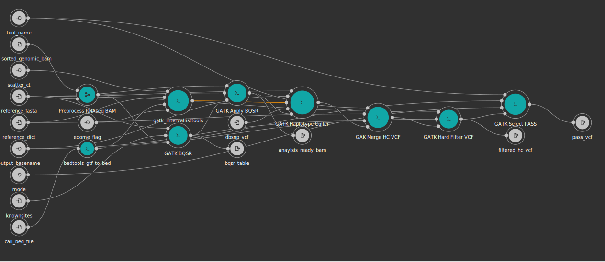
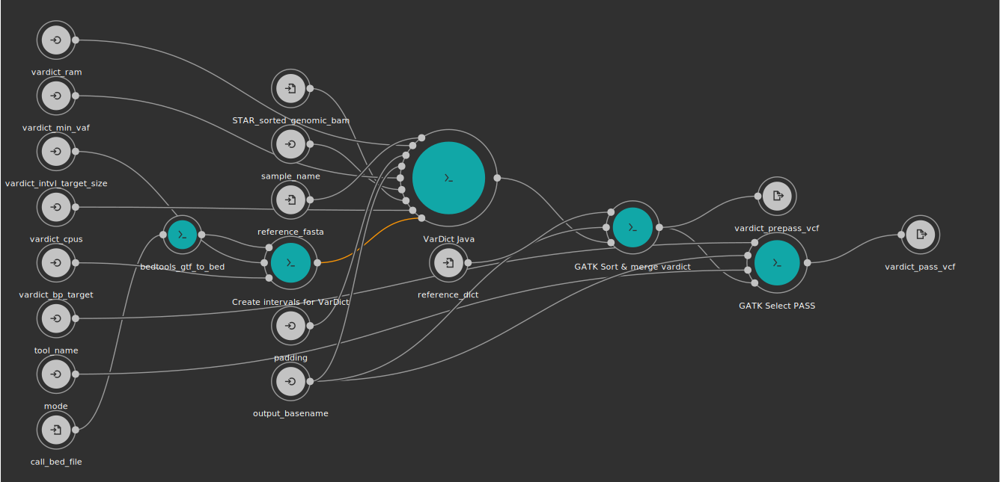

# RNAseq SNV Calling Workflow (beta)
This repo contains snv calling methods using Broad GATK best practices.
It also contains a very basic VEP annotation tool and fusion calling tools used by the Kids First Data Resource Center.
The results are available on Cavatica from the [Data Delivery Project](https://cavatica.sbgenomics.com/u/d3b-bixu/rs-vpf5jbc3/).
Please contact Deanne Taylor or Chris Mason for access.
Additional unused, but possibly useful RNAseq SNV workflows are appended at the end

<p align="center">
  
</p>

For all workflows, input bams should be indexed beforehand.  This tool is provided in `tools/samtools_index.cwl`

## GATK4 v4.1.7.0
The overall [workflow](https://gatk.broadinstitute.org/hc/en-us/articles/360035531192-RNAseq-short-variant-discovery-SNPs-Indels-) picks up from post-STAR alignment, starting at mark duplicates.
For the most part, tool parameters follow defaults from the GATK Best Practices [WDL](https://github.com/gatk-workflows/gatk4-rnaseq-germline-snps-indels/blob/master/gatk4-rna-best-practices.wdl), written in cwl with added optimization for use on the Cavatica platform.
A mild warning, sambamba is used in this workflow to mark dulicates for speed and efficiency instead of picard.
Behavior should be the same except for markig optical duplicates.
`workflows/d3b_gatk_rnaseq_snv_wf.cwl` is the wrapper cwl used to run all tools for GATK4.
Run time (n=732) COV-IRT dataset, ~3 hours, cost on cavatica ~$1.15 per sample

### Inputs
```yaml
inputs:
  output_basename: string
  scatter_ct: {type: int?, doc: "Number of interval lists to split into", default: 50}
  STAR_sorted_genomic_bam: {type: File, doc: "STAR sorted alignment bam"}
  reference_fasta: {type: File, secondaryFiles: ['^.dict', '.fai'], doc: "Reference genome used"}
  reference_dict: File
  call_bed_file: {type: File, doc: "BED or GTF intervals to make calls"}
  exome_flag: {type: string?, default: "Y", doc: "Whether to run in exome mode for callers. Should be Y or leave blank as default is Y. Only make N if you are certain"}
  knownsites: {type: 'File[]', doc: "Population vcfs, based on Broad best practices"}
  dbsnp_vcf: {type: File, secondaryFiles: ['.idx']}
  tool_name: {type: string, doc: "description of tool that generated data, i.e. gatk_haplotypecaller"}
  mode: {type: ['null', {type: enum, name: select_vars_mode, symbols: ["gatk", "grep"]}], doc: "Choose 'gatk' for SelectVariants tool, or 'grep' for grep expression", default: "gatk"}
```

### Outputs
```yaml
outputs:
  filtered_hc_vcf: {type: File, outputSource: gatk_filter_vcf/filtered_vcf, doc: "Haplotype called vcf with Broad-recommended FILTER values added"}
  pass_vcf: {type: File, outputSource: gatk_pass_vcf/pass_vcf, doc: "Filtered vcf selected for PASS variants"}
  anaylsis_ready_bam: {type: File, outputSource: gatk_applybqsr/recalibrated_bam, doc: "Duplicate marked, Split N trimmed CIGAR BAM, BQSR recalibratede, ready for RNAseq calling"}
  bqsr_table: {type: File, outputSource: gatk_baserecalibrator/output, doc: "BQSR table"}
```

### Docker Pulls
 - `kfdrc/sambamba:0.7.1`
 - `kfdrc/gatk:4.1.7.0R`

### GATK4 RNAseq SNV Workflow Diagram



### GATK4 simulated bash calls

 | Step                                         | Type         | Num scatter            | Command                                                                                                                                                                                                         |
 | -------------------------------------------- | ------------ | ---------------------- | --------------------------------------------------------------------------------------------------------------------------------------------------------------------------------------------------------------- |
 | bedtools_gtf_to_bed                                         | run step         | NA            | /bin/bash -c set -eo pipefail                                                                                                                                                                                                         |
 | bedtools_gtf_to_bed                                         | run step         | NA            |                                                                                                                                                                                                          |
 | bedtools_gtf_to_bed                                         | run step         | NA            | cat /sbgenomics/Projects/7c22397d-ea11-4069-9687-3049119a2d37/ENS100_MN908947.3.dna.primary_assembly.gtf | grep -vE "^#" | cut -f 1,4,5 | awk '{OFS = "\t";a=$2-1;print $1,a,$3; }' | bedtools sort | bedtools merge > ENS100_MN908947.3.dna.primary_assembly.gtf.bed                                                                                                                                                                                                         |
 | preprocess_rnaseq_bam_sambamba_md_sorted                                         | run step         | NA            | /bin/bash -c set -eo pipefail                                                                                                                                                                                                         |
 | preprocess_rnaseq_bam_sambamba_md_sorted                                         | run step         | NA            | mkdir TMP                                                                                                                                                                                                         |
 | preprocess_rnaseq_bam_sambamba_md_sorted                                         | run step         | NA            | sambamba markdup --tmpdir TMP -t 4 /sbgenomics/Projects/7c22397d-ea11-4069-9687-3049119a2d37/NASA_HEC_transferred_data/COVIRT_all_data_20200729/02-AlignedData/COVSUBJ_0048_1_N_HA_all-reads/COVSUBJ_0048_1_N_HA_all-reads_Aligned.sortedByCoord_sorted.out.bam COVSUBJ_0048_1_N_HA_all-reads_Aligned.sortedByCoord_sorted.out.md.bam                                                                                                                                                                                                         |
 | preprocess_rnaseq_bam_sambamba_md_sorted                                         | run step         | NA            | mv COVSUBJ_0048_1_N_HA_all-reads_Aligned.sortedByCoord_sorted.out.md.bam.bai COVSUBJ_0048_1_N_HA_all-reads_Aligned.sortedByCoord_sorted.out.md.bai                                                                                                                                                                                                         |
 | gatk_intervallisttools                                         | run step         | NA            | /bin/bash -c set -eo pipefail                                                                                                                                                                                                         |
 | gatk_intervallisttools                                         | run step         | NA            | /gatk BedToIntervalList -I /sbgenomics/workspaces/7c22397d-ea11-4069-9687-3049119a2d37/tasks/00210a5f-77ec-4d07-9b1d-c08e5497e24c/bedtools_gtf_to_bed/ENS100_MN908947.3.dna.primary_assembly.gtf.bed -O ENS100_MN908947.3.dna.primary_assembly.gtf.interval_list -SD /sbgenomics/Projects/7c22397d-ea11-4069-9687-3049119a2d37/ENS100_MN908947.3.dna.primary_assembly.dict; LIST=ENS100_MN908947.3.dna.primary_assembly.gtf.interval_list;BANDS=0;                                                                                                                                                                                                         |
 | gatk_intervallisttools                                         | run step         | NA            | /gatk IntervalListTools --java-options "-Xmx2000m" --SCATTER_COUNT=50 --SUBDIVISION_MODE=BALANCING_WITHOUT_INTERVAL_SUBDIVISION_WITH_OVERFLOW --UNIQUE=true --SORT=true --BREAK_BANDS_AT_MULTIPLES_OF=$BANDS --INPUT=$LIST --OUTPUT=.;CT=`find . -name 'temp_0*' | wc -l`;seq -f "%04g" $CT | xargs -I N -P 4 /gatk IntervalListToBed --java-options -Xmx100m -I temp_N_of_$CT/scattered.interval_list -O temp_N_of_$CT/scattered.interval_list.N.bed;mv temp_0*/*.bed .;                                                                                                                                                                                                         |
 | preprocess_rnaseq_bam_gatk_splitntrim                                         | run step         | NA            | /gatk SplitNCigarReads --java-options "-Xmx30G -XX:+PrintFlagsFinal -Xloggc:gc_log.log -XX:GCTimeLimit=50 -XX:GCHeapFreeLimit=10" --seconds-between-progress-updates 30 -R /sbgenomics/Projects/7c22397d-ea11-4069-9687-3049119a2d37/ENS100_MN908947.3.dna.primary_assembly.fa -I /sbgenomics/workspaces/7c22397d-ea11-4069-9687-3049119a2d37/tasks/00210a5f-77ec-4d07-9b1d-c08e5497e24c/preprocess_rnaseq_bam_sambamba_md_sorted/COVSUBJ_0048_1_N_HA_all-reads_Aligned.sortedByCoord_sorted.out.md.bam  -OBI -O COVSUBJ_0048_1_N_HA_all-reads_Aligned.sortedByCoord_sorted.out.md.splitn.bam                                                                                                                                                                                                         |
 | gatk_baserecalibrator                                         | run step         | NA            | /gatk BaseRecalibrator --java-options "-Xmx7500m -XX:GCTimeLimit=50 -XX:GCHeapFreeLimit=10 -XX:+PrintFlagsFinal -XX:+PrintGCTimeStamps -XX:+PrintGCDateStamps -XX:+PrintGCDetails -Xloggc:gc_log.log" -R /sbgenomics/Projects/7c22397d-ea11-4069-9687-3049119a2d37/ENS100_MN908947.3.dna.primary_assembly.fa -I /sbgenomics/workspaces/7c22397d-ea11-4069-9687-3049119a2d37/tasks/00210a5f-77ec-4d07-9b1d-c08e5497e24c/preprocess_rnaseq_bam_gatk_splitntrim/COVSUBJ_0048_1_N_HA_all-reads_Aligned.sortedByCoord_sorted.out.md.splitn.bam --use-original-qualities -O COVSUBJ_0048_1_N_HA_all-reads_Aligned.sortedByCoord_sorted.out.md.splitn.recal_data.csv  --known-sites /sbgenomics/Projects/7c22397d-ea11-4069-9687-3049119a2d37/GATK4_VCF_REFS/Homo_sapiens_assembly38.ens100.known_indels.vcf.gz --known-sites /sbgenomics/Projects/7c22397d-ea11-4069-9687-3049119a2d37/GATK4_VCF_REFS/Mills_and_1000G_gold_standard.indels.hg38.ens100.vcf.gz                                                                                                                                                                                                         |
 | gatk_applybqsr                                         | run step         | NA            | /gatk ApplyBQSR --java-options "-Xms3000m -Xmx7500m -XX:+PrintFlagsFinal -XX:+PrintGCTimeStamps -XX:+PrintGCDateStamps -XX:+PrintGCDetails -Xloggc:gc_log.log -XX:GCTimeLimit=50 -XX:GCHeapFreeLimit=10" --create-output-bam-md5 --add-output-sam-program-record -R /sbgenomics/Projects/7c22397d-ea11-4069-9687-3049119a2d37/ENS100_MN908947.3.dna.primary_assembly.fa -I /sbgenomics/workspaces/7c22397d-ea11-4069-9687-3049119a2d37/tasks/00210a5f-77ec-4d07-9b1d-c08e5497e24c/preprocess_rnaseq_bam_gatk_splitntrim/COVSUBJ_0048_1_N_HA_all-reads_Aligned.sortedByCoord_sorted.out.md.splitn.bam --use-original-qualities -O COVSUBJ_0048_1_N_HA_all-reads_Aligned.sortedByCoord_sorted.out.md.splitn.aligned.duplicates_marked.recalibrated.bam -bqsr /sbgenomics/workspaces/7c22397d-ea11-4069-9687-3049119a2d37/tasks/00210a5f-77ec-4d07-9b1d-c08e5497e24c/gatk_baserecalibrator/COVSUBJ_0048_1_N_HA_all-reads_Aligned.sortedByCoord_sorted.out.md.splitn.recal_data.csv                                                                                                                                                                                                         |
 | gatk_haplotype_rnaseq                                         | scatter         | 50            | /gatk HaplotypeCaller -R /sbgenomics/Projects/7c22397d-ea11-4069-9687-3049119a2d37/ENS100_MN908947.3.dna.primary_assembly.fa -I /sbgenomics/workspaces/7c22397d-ea11-4069-9687-3049119a2d37/tasks/00210a5f-77ec-4d07-9b1d-c08e5497e24c/gatk_applybqsr/COVSUBJ_0048_1_N_HA_all-reads_Aligned.sortedByCoord_sorted.out.md.splitn.aligned.duplicates_marked.recalibrated.bam --standard-min-confidence-threshold-for-calling 20 -dont-use-soft-clipped-bases -L /sbgenomics/workspaces/7c22397d-ea11-4069-9687-3049119a2d37/tasks/00210a5f-77ec-4d07-9b1d-c08e5497e24c/gatk_intervallisttools/scattered.interval_list.0039.bed -O 00210a5f-77ec-4d07-9b1d-c08e5497e24c.gatk.hc.called.vcf.gz --dbsnp /sbgenomics/Projects/7c22397d-ea11-4069-9687-3049119a2d37/GATK4_VCF_REFS/dbSNP_v153_ens.vcf.gz                                                                                                                                                                                                         |
 | merge_hc_vcf                                         | run step         | NA            | /gatk MergeVcfs --java-options "-Xmx2000m" --TMP_DIR=./TMP --CREATE_INDEX=true --SEQUENCE_DICTIONARY=/sbgenomics/Projects/7c22397d-ea11-4069-9687-3049119a2d37/ENS100_MN908947.3.dna.primary_assembly.dict --OUTPUT=00210a5f-77ec-4d07-9b1d-c08e5497e24c.STAR_GATK4.merged.vcf.gz  -I /sbgenomics/workspaces/7c22397d-ea11-4069-9687-3049119a2d37/tasks/00210a5f-77ec-4d07-9b1d-c08e5497e24c/gatk_haplotype_rnaseq_1_s/00210a5f-77ec-4d07-9b1d-c08e5497e24c.gatk.hc.called.vcf.gz -I /sbgenomics/workspaces/7c22397d-ea11-4069-9687-3049119a2d37/tasks/00210a5f-77ec-4d07-9b1d-c08e5497e24c/gatk_haplotype_rnaseq_2_s/00210a5f-77ec-4d07-9b1d-c08e5497e24c.gatk.hc.called.vcf.gz -I /sbgenomics/workspaces/7c22397d-ea11-4069-9687-3049119a2d37/tasks/00210a5f-77ec-4d07-9b1d-c08e5497e24c/gatk_haplotype_rnaseq_3_s/00210a5f-77ec-4d07-9b1d-c08e5497e24c.gatk.hc.called.vcf.gz                                                                                                                                                                                                          |
 | gatk_filter_vcf                                         | run step         | NA            | /gatk VariantFiltration -R /sbgenomics/Projects/7c22397d-ea11-4069-9687-3049119a2d37/ENS100_MN908947.3.dna.primary_assembly.fa -V /sbgenomics/workspaces/7c22397d-ea11-4069-9687-3049119a2d37/tasks/00210a5f-77ec-4d07-9b1d-c08e5497e24c/merge_hc_vcf/00210a5f-77ec-4d07-9b1d-c08e5497e24c.STAR_GATK4.merged.vcf.gz --window 35 --cluster 3 --filter-name "FS" --filter "FS > 30.0" --filter-name "QD" --filter "QD < 2.0"  -O 00210a5f-77ec-4d07-9b1d-c08e5497e24c.gatk.hc.filtered.vcf.gz                                                                                                                                                                                                         |
 | gatk_pass_vcf                                         | run step         | NA            | /bin/bash -c set -eo pipefail                                                                                                                                                                                                         |
 | gatk_pass_vcf                                         | run step         | NA            | /gatk SelectVariants --java-options "-Xmx7500m" -V /sbgenomics/workspaces/7c22397d-ea11-4069-9687-3049119a2d37/tasks/00210a5f-77ec-4d07-9b1d-c08e5497e24c/gatk_filter_vcf/00210a5f-77ec-4d07-9b1d-c08e5497e24c.gatk.hc.filtered.vcf.gz -O 00210a5f-77ec-4d07-9b1d-c08e5497e24c.STAR_GATK4.PASS.vcf.gz --exclude-filtered TRUE                                                                                                                                                                                                         |


## Variant Effect Predictor
[Variant Effect Predictor](https://useast.ensembl.org/info/docs/tools/vep/index.html) is an ENSEMBL tool for annotating variants.
The tool built for this repo has very basic and rigid functionality, but can be run on any of the vcf outputs from the worfklows.
`tools/variant_effect_predictor.cwl`.
Run time (n=782) COV-IRT dataset,  ~6 minutes, cost on cavatica ~$0.22 per sample


### VEP simulated bash calls

 | Step                 | Type         | Num scatter            | Command                                                                                                                                                                                                         |
 | -------------------- | ------------ | ---------------------- | --------------------------------------------------------------------------------------------------------------------------------------------------------------------------------------------------------------- |
 | vep-1oo-annotate                 | run step         | NA            | /bin/bash -c set -eo pipefail                                                                                                                                                                                                         |
 | vep-1oo-annotate                 | run step         | NA            | tar -xzf /sbgenomics/Projects/7c22397d-ea11-4069-9687-3049119a2d37/homo_sapiens_merged_vep_100_GRCh38.tar.gz                                                                                                                                                                                                       |
 | vep-1oo-annotate                 | run step         | NA            | perl /ensembl-vep/vep --cache --dir_cache $PWD --cache_version 100 --vcf --symbol  --merged  --canonical --variant_class --offline --ccds --uniprot --protein --numbers --hgvs --hgvsg --fork 14 --sift b --vcf_info_field ANN -i /sbgenomics/Projects/7c22397d-ea11-4069-9687-3049119a2d37/3c3c570b-cd69-4106-b169-ffa65411ec5a.STAR_GATK4.PASS.vcf.gz -o STDOUT --stats_file 9aeaeaf3-0e59-4c92-a709-c6bd37431294_stats.txt --stats_text --warning_file 9aeaeaf3-0e59-4c92-a709-c6bd37431294_warnings.txt --allele_number --dont_skip --allow_non_variant --fasta /sbgenomics/Projects/7c22397d-ea11-4069-9687-3049119a2d37/NASA_HEC_transferred_data/genome_files/Homo_sapiens_ensembl_release100/Homo_sapiens.GRCh38.dna.primary_assembly_mainchrs_and_SARS-CoV-2-NC_045512.2.fa | /ensembl-vep/htslib/bgzip -@ 14 -c > 9aeaeaf3-0e59-4c92-a709-c6bd37431294.STAR_GATK4.vep.vcf.gz && /ensembl-vep/htslib/tabix 9aeaeaf3-0e59-4c92-a709-c6bd37431294.STAR_GATK4.vep.vcf.gz                                                                                                                                                                                                         |

```yaml
inputs:
  reference: {type: File,  secondaryFiles: [.fai], label: Fasta genome assembly with index}
  input_vcf:
    type: File
    secondaryFiles: [.tbi]
  output_basename: string
  merged_cache: {type: boolean, doc: "If merged cache being used", default: true}
  tool_name: {type: string, doc: "Name of tool used to generate calls"}
  cache: {type: File, label: tar gzipped cache from ensembl/local converted cache}
  ```

```yaml
outputs:
  output_vcf:
    type: File
    outputBinding:
      glob: '*.vcf.gz'
    secondaryFiles: [.tbi]
  output_txt:
    type: File
    outputBinding:
      glob: '*_stats.txt'
  warn_txt:
    type: ["null", File]
    outputBinding:
      glob: '*_warnings.txt'
```

# Fusion Calls

## STAR-Fusion v1.9.0
Tool built to run the [STAR-Fusion](https://github.com/STAR-Fusion/STAR-Fusion/wiki) caller.
`tools/star_fusion_covirt.cwl` is the tool that runs this software.
Run time per sample (n=732) ~9 minutes, cost on cavatica ~$0.10

```yaml
inputs:
  Chimeric_junction: {type: File, doc: "Output from STAR alignment run"}
  genome_tar: {type: File, doc: "STAR-Fusion reference"}
  genome_untar_path: {type: ['null', string], doc: "This is what the path will be when genome_tar is unpackaged", default: "ctat_genome_lib_build_dir"}
  SampleID: string
```

```yaml
outputs:
  abridged_coding:
    type: File
    outputBinding:
      glob: '*.fusion_predictions.abridged.coding_effect.tsv'
  chimeric_junction_compressed:
    type: File
    outputBinding:
      glob: "$(inputs.Chimeric_junction.basename).gz"
```

### Docker Pulls
 - `trinityctat/starfusion:1.9.0`

### STAR-Fusion simulated bash calls

```
tar -zxf /sbgenomics/Projects/7c22397d-ea11-4069-9687-3049119a2d37/ENS100_MN908947.3_CUSTOM_STAR_FUSION.tgz;
/usr/local/src/STAR-Fusion/STAR-Fusion --genome_lib_dir ./ctat_genome_lib_build_dir -J /sbgenomics/Projects/7c22397d-ea11-4069-9687-3049119a2d37/NASA_HEC_transferred_data/COVIRT_all_data_20200729/02-AlignedData/COVSUBJ_0166_1_N_HA_all-reads/COVSUBJ_0166_1_N_HA_all-reads_Chimeric.out.junction --output_dir STAR-Fusion_outdir --examine_coding_effect --CPU 16
mv STAR-Fusion_outdir/star-fusion.fusion_predictions.abridged.coding_effect.tsv 04e94955-c96f-4d78-b9e7-c032d3de7ace.STAR.fusion_predictions.abridged.coding_effect.tsv
gzip -c /sbgenomics/Projects/7c22397d-ea11-4069-9687-3049119a2d37/NASA_HEC_transferred_data/COVIRT_all_data_20200729/02-AlignedData/COVSUBJ_0166_1_N_HA_all-reads/COVSUBJ_0166_1_N_HA_all-reads_Chimeric.out.junction > COVSUBJ_0166_1_N_HA_all-reads_Chimeric.out.junction.gz
```

## arriba v1.1.0
Tool built to run [arriba fusion caller](https://github.com/suhrig/arriba).
Tool used to run software `tools/arriba_fusion.cwl`.
Run time per sample (n=732) ~18 minutes, cost on cavatica ~$0.09

```yaml
 inputs:
  genome_aligned_bam: File
  genome_aligned_bai: File
  chimeric_sam_out: {type: File, doc: "Chimeric reads from STAR aligner as sam output"}
  reference_fasta: File
  gtf_anno: File
  outFileNamePrefix: string
  arriba_strand_flag: ['null', string]
```

```yaml
outputs:
  arriba_fusions:
    type: File
    outputBinding:
      glob: "$(inputs.outFileNamePrefix).arriba.fusions.tsv"
  arriba_pdf:
    type: File
    outputBinding:
      glob: "$(inputs.outFileNamePrefix).arriba.fusions.pdf"
```

### Docker Pulls:
 - `kfdrc/arriba:1.1.0`

### arriba simulated bash calls

```
/arriba_v1.1.0/arriba -c /sbgenomics/Projects/7c22397d-ea11-4069-9687-3049119a2d37/NASA_HEC_transferred_data/COVIRT_all_data_20200729/02-AlignedData/COVSUBJ_0668_1_P_HA_all-reads/COVSUBJ_0668_1_P_HA_all-reads_Chimeric.out.sam -x /sbgenomics/Projects/7c22397d-ea11-4069-9687-3049119a2d37/NASA_HEC_transferred_data/COVIRT_all_data_20200729/02-AlignedData/COVSUBJ_0668_1_P_HA_all-reads/COVSUBJ_0668_1_P_HA_all-reads_Aligned.sortedByCoord_sorted.out.bam -a /sbgenomics/Projects/7c22397d-ea11-4069-9687-3049119a2d37/ENS100_MN908947.3.dna.primary_assembly.fa -g /sbgenomics/Projects/7c22397d-ea11-4069-9687-3049119a2d37/ENS100_MN908947.3.dna.primary_assembly.gtf -o 22810c80-7ef5-4c6e-ab5d-4df0487b7eba.arriba.fusions.tsv -O 22810c80-7ef5-4c6e-ab5d-4df0487b7eba.arriba.discarded_fusions.tsv -b /arriba_v1.1.0/database/blacklist_hg38_GRCh38_2018-11-04.tsv.gz -T -P -s auto
/arriba_v1.1.0/draw_fusions.R --annotation=/sbgenomics/Projects/7c22397d-ea11-4069-9687-3049119a2d37/ENS100_MN908947.3.dna.primary_assembly.gtf --fusions=22810c80-7ef5-4c6e-ab5d-4df0487b7eba.arriba.fusions.tsv --alignments=/sbgenomics/Projects/7c22397d-ea11-4069-9687-3049119a2d37/NASA_HEC_transferred_data/COVIRT_all_data_20200729/02-AlignedData/COVSUBJ_0668_1_P_HA_all-reads/COVSUBJ_0668_1_P_HA_all-reads_Aligned.sortedByCoord_sorted.out.bam --cytobands=/arriba_v1.1.0/database/cytobands_hg38_GRCh38_2018-02-23.tsv --proteinDomains=/arriba_v1.1.0/database/protein_domains_hg38_GRCh38_2018-03-06.gff3 --output=22810c80-7ef5-4c6e-ab5d-4df0487b7eba.arriba.fusions.pdf
```

## annoFuse
annoFuse is an added workflow to run the artifact filtering portion of [annoFuse](https://www.biorxiv.org/content/10.1101/839738v1).
Developed collaboratively between the Center for Data Driven Discovery in Biomedicine (D3b) and the Alex's Lemonade Stand Childhood Cancer Data Lab, this package adds annotation to arriba results, artifact filtering, and removes low-confidence fusion calls, as described in the paper.
Run time (n=732) COV-IRT dataset,  ~16 minutes, cost on cavatica ~$0.08 per sample

```yaml
inputs:
  sample_name: {type: string, doc: "Sample name used for file base name of all outputs"}
  FusionGenome: {type: File, doc: "GRCh38_v27_CTAT_lib_Feb092018.plug-n-play.tar.gz", sbg:suggestedValue: {class: 'File', path: '5d8bb21fe4b0950c4028f854', name: 'GRCh38_v27_CTAT_lib_Feb092018.plug-n-play.tar.gz'}} # Custom input was used for COV-IRT
  genome_untar_path: {type: ['null', string], doc: "This is what the path will be when genome_tar is unpackaged", default: "GRCh38_v27_CTAT_lib_Feb092018/ctat_genome_lib_build_dir"}
  rsem_expr_file: {type: File, doc: "gzipped rsem gene expression file"}
  arriba_output_file: {type: File, doc: "Output from arriba, usually extension arriba.fusions.tsv"}
  col_num: {type: ['null', int], doc: "column number in file of fusion name", default: 25}
  star_fusion_output_file: {type: File, doc: "Output from arriba, usually extension STAR.fusion_predictions.abridged.coding_effect.tsv"}
  output_basename: string
```

```yaml
outputs:
  annofuse_filtered_fusions_tsv: {type: File?, outputSource: annoFuse_filter/filtered_fusions_tsv, doc: "Filtered output of formatted and annotated Star Fusion and arriba results"}
```

### Docker Pulls
 - `kfdrc/annofuse:0.1.8`
 - `gaonkark/fusionanno:latest`
 - `kfdrc/annofuse:0.1.8`

 ### annoFuse simulated bash calls

 | Step                         | Type         | Num scatter            | Command                                                                                                                                                                                                         |
 | ---------------------------- | ------------ | ---------------------- | --------------------------------------------------------------------------------------------------------------------------------------------------------------------------------------------------------------- |
 | format_arriba_output                         | run step         | NA            | Rscript /rocker-build/formatFusionCalls.R --fusionfile /sbgenomics/Projects/7c22397d-ea11-4069-9687-3049119a2d37/3321a8b3-a1f9-46e9-988d-f2b4452b8633.arriba.fusions.tsv --tumorid COVSUBJ_0663_1_P --caller arriba --outputfile COVSUBJ_0663_1_P.arriba_formatted.tsv                                                                                                                                                                                                         |
 | annotate_arriba                         | run step         | NA            | tar -zxf /sbgenomics/Projects/7c22397d-ea11-4069-9687-3049119a2d37/ENS100_MN908947.3_CUSTOM_STAR_FUSION.tgz && /opt/FusionAnnotator/FusionAnnotator --genome_lib_dir ./ctat_genome_lib_build_dir --annotate /sbgenomics/workspaces/7c22397d-ea11-4069-9687-3049119a2d37/tasks/c5bfb05c-6fce-4b0b-abb4-3626f71e254f/format_arriba_output/COVSUBJ_0663_1_P.arriba_formatted.tsv --fusion_name_col 25 > c5bfb05c-6fce-4b0b-abb4-3626f71e254f.annotated.tsv                                                                                                                                                                                                         |
 | format_starfusion_output                         | run step         | NA            | Rscript /rocker-build/formatFusionCalls.R --fusionfile /sbgenomics/Projects/7c22397d-ea11-4069-9687-3049119a2d37/85a181d4-db70-4b7a-bd62-d70d59448826.STAR.fusion_predictions.abridged.coding_effect.tsv --tumorid COVSUBJ_0663_1_P --caller starfusion --outputfile COVSUBJ_0663_1_P.starfusion_formatted.tsv                                                                                                                                                                                                         |
 | annoFuse_filter                         | run step         | NA            | A_CT=`wc -l /sbgenomics/workspaces/7c22397d-ea11-4069-9687-3049119a2d37/tasks/c5bfb05c-6fce-4b0b-abb4-3626f71e254f/annotate_arriba/c5bfb05c-6fce-4b0b-abb4-3626f71e254f.annotated.tsv | cut -f 1 -d " "`                                                                                                                                                                                                         |
 | annoFuse_filter                         | run step         | NA            | S_CT=`wc -l /sbgenomics/workspaces/7c22397d-ea11-4069-9687-3049119a2d37/tasks/c5bfb05c-6fce-4b0b-abb4-3626f71e254f/format_starfusion_output/COVSUBJ_0663_1_P.starfusion_formatted.tsv | cut -f 1 -d " "`                                                                                                                                                                                                         |
 | annoFuse_filter                         | run step         | NA            | if [ $A_CT -eq 1 ] && [ $S_CT -eq 1 ]; then                                                                                                                                                                                                         |
 | annoFuse_filter                         | run step         | NA            |   echo "Both inputs are empty, will skip processing as there no fusions." >&2;                                                                                                                                                                                                         |
 | annoFuse_filter                         | run step         | NA            |   exit 0;                                                                                                                                                                                                         |
 | annoFuse_filter                         | run step         | NA            | fi                                                                                                                                                                                                         |
 | annoFuse_filter                         | run step         | NA            | Rscript /rocker-build/annoFusePerSample.R --fusionfileArriba /sbgenomics/workspaces/7c22397d-ea11-4069-9687-3049119a2d37/tasks/c5bfb05c-6fce-4b0b-abb4-3626f71e254f/annotate_arriba/c5bfb05c-6fce-4b0b-abb4-3626f71e254f.annotated.tsv --fusionfileStarFusion /sbgenomics/workspaces/7c22397d-ea11-4069-9687-3049119a2d37/tasks/c5bfb05c-6fce-4b0b-abb4-3626f71e254f/format_starfusion_output/COVSUBJ_0663_1_P.starfusion_formatted.tsv --expressionFile /sbgenomics/Projects/7c22397d-ea11-4069-9687-3049119a2d37/NASA_HEC_transferred_data/COVIRT_all_data_20200729/03-RSEMcountData/COVSUBJ_0663_1_P_HA_all-reads.genes.results --tumorID COVSUBJ_0663_1_P --outputfile c5bfb05c-6fce-4b0b-abb4-3626f71e254f.annoFuse_filter.tsv                                                                                                                                                                                                         |

### annoFuse Workflow Diagram


# Kraken2
This tool allows users to process fastq reads and tease out by species in order to remove sensitive data
[Kraken2](http://ccb.jhu.edu/software/kraken2/index.shtml) is available to run at `tools/kraken2_classification.cwl`.


```yaml
inputs:
  input_db: { type: File, doc: "Input TGZ containing Kraken2 database" }
  input_reads: { type: File, doc: "FA or FQ file containing sequences to be classified" }
  input_mates: { type: 'File?', doc: "Paired mates for input_reads" }
  db_path: { type: string, default: "./covid", doc: "Relative path to the folder containing the db files from input_db" }
  threads: { type: int, default: 32, doc: "Number of threads to use in parallel" }
  ram: { type: int, default: 50000, doc: "Recommended MB of RAM needed to run the job" }
  output_basename: { type: string, doc: "String to be used as the base filename of the output" }
```

```yaml
outputs:
  output: { type: File, outputBinding: { glob: "*.output" } }
  classified_reads: { type: 'File', outputBinding: { glob: "*_1.fq" } }
  classified_mates: { type: 'File?', outputBinding: { glob: "*_2.fq" } }
```

# Other RNAseq SNV Workflows

## Strelka2 v2.9.10
This [workflow](https://github.com/Illumina/strelka/blob/v2.9.x/docs/userGuide/README.md#rna-seq) is pretty straight forward, with a `PASS` filter step added to get `PASS` calls.
`workflows/d3b_strelka2_rnaseq_snv_wf.cwl` is the wrapper cwl that runs this workflow.
Run time per sample (n=1) ~50 minutes, cost on cavatica ~$0.40

### Inputs
```yaml
inputs:
  reference: { type: File, secondaryFiles: [.fai] }
  input_rna_bam: {type: File, secondaryFiles: [^.bai]}
  strelka2_bed: {type: File?, secondaryFiles: [.tbi], label: gzipped bed file}
  cores: {type: ['null', int], default: 16, doc: "Num cores to use"}
  ram: {type: ['null', int], default: 30, doc: "Max mem to use in GB"}
  output_basename: string
```

### Outputs
```yaml
  strelka2_prepass_vcf: {type: File, outputSource: strelka2_rnaseq/output_vcf, doc: "Strelka2 SNV calls"}
  strelka2_pass_vcf: {type: File, outputSource: gatk_pass_vcf/pass_vcf, doc: "Strelka2 calls filtered on PASS"}
```

### Docker Pulls
 - `kfdrc/strelka2:2.9.10`
 - `kfdrc/gatk:4.1.1.0`

### Workflow Diagram


### Strelka2 simulated bash calls

 | Step                | Type         | Num scatter            | Command                                                                                                                                                                                                         |
 | ------------------- | ------------ | ---------------------- | --------------------------------------------------------------------------------------------------------------------------------------------------------------------------------------------------------------- |
 | strelka2_rnaseq                | run step         | NA            | /strelka-2.9.10.centos6_x86_64/bin/configureStrelkaGermlineWorkflow.py --bam /sbgenomics/Projects/598f0ba4-d8a8-45e7-8bf2-1fe004e4979a/da63df67-62a4-487b-aa68-d7f139809160.Aligned.out.sorted.bam --reference /sbgenomics/Projects/598f0ba4-d8a8-45e7-8bf2-1fe004e4979a/GRCh38.primary_assembly.genome.fa  --rna --runDir ./ && ./runWorkflow.py -m local -j 16 -g 30                                                                                                                                                                                                         |
 | strelka2_rnaseq                | run step         | NA            | mv results/variants/variants.vcf.gz STRELKA2_TEST.strelka2.rnaseq.vcf.gz                                                                                                                                                                                                         |
 | strelka2_rnaseq                | run step         | NA            | mv results/variants/variants.vcf.gz.tbi STRELKA2_TEST.strelka2.rnaseq.vcf.gz.tbi                                                                                                                                                                                                         |
 | gatk_pass_vcf                | run step         | NA            | /bin/bash -c set -eo pipefail                                                                                                                                                                                                         |
 | gatk_pass_vcf                | run step         | NA            | /gatk SelectVariants --java-options "-Xmx7500m" -V /sbgenomics/workspaces/598f0ba4-d8a8-45e7-8bf2-1fe004e4979a/tasks/5f77306d-9650-4b82-83e1-1623eb07e211/strelka2_rnaseq/STRELKA2_TEST.strelka2.rnaseq.vcf.gz -O STRELKA2_TEST.strelka2.PASS.vcf.gz --exclude-filtered TRUE                                                                                                                                                                                                         |

## VardictJava v1.7.0
This [workflow](https://github.com/bcbio/bcbio-nextgen/blob/master/bcbio/rnaseq/variation.py) is based on the Vardict run style of BC Bio.
`workflows/d3b_vardict_rnaseq_snv_wf.cwl` is the wrapper cwl that runs this workflow.
Tweaking `vardict_bp_target` and `vardict_intvl_target_size` maybe be needed to improve run time in high coverage areas, by reducing their values from defaults.
Run time (n=1) ~9.5 hours, cost on cavatica ~$5.50.

### Inputs
```yaml
inputs:
  output_basename: string
  STAR_sorted_genomic_bam: {type: File, doc: "STAR sorted alignment bam", secondaryFiles: ['^.bai']}
  sample_name: string
  reference_fasta: {type: File, secondaryFiles: ['.fai', '^.dict'], doc: "Reference genome used"}
  reference_dict: File
  vardict_min_vaf: {type: ['null', float], doc: "Min variant allele frequency for vardict to consider.  Recommend 0.2", default: 0.2}
  vardict_cpus: {type: ['null', int], default: 4}
  vardict_ram: {type: ['null', int], default: 8, doc: "In GB"}
  vardict_bp_target: {type: ['null', int], doc: "Intended max number of base pairs per file.  Existing intervals large than this will NOT be split into another file. Make this value smaller to break up the work into smaller chunks", default: 60000000}
  vardict_intvl_target_size: {type: ['null', int], doc: "For each file, split each interval into chuck of this size", default: 20000}
  call_bed_file: {type: File, doc: "BED or GTF intervals to make calls"}
  tool_name: {type: string, doc: "description of tool that generated data, i.e. gatk_haplotypecaller"}
  padding: {type: ['null', int], doc: "Padding to add to input intervals, recommened 0 if intervals already padded, 150 if not", default: 150}
  mode: {type: ['null', {type: enum, name: select_vars_mode, symbols: ["gatk", "grep"]}], doc: "Choose 'gatk' for SelectVariants tool, or 'grep' for grep expression", default: "gatk"}
```

### Outputs
```yaml
outputs:
  vardict_prepass_vcf: {type: File, outputSource: sort_merge_vardict_vcf/merged_vcf, doc: "VarDict SNV calls"}
  vardict_pass_vcf: {type: File, outputSource: gatk_pass_vcf/pass_vcf, doc: "VarDict calls filtered on PASS"}
```

### Docker Pulls
- `kfdrc/vardict:1.7.0`
- `kfdrc/gatk:4.1.1.0`
- `kfdrc/python:2.7.13`

### Workflow Diagram



### Vardict simulated bash calls

 | Step                              | Type         | Num scatter            | Command                                                                                                                                                                                                         |
 | --------------------------------- | ------------ | ---------------------- | --------------------------------------------------------------------------------------------------------------------------------------------------------------------------------------------------------------- |
 | bedtools_gtf_to_bed                              | run step         | NA            | /bin/bash -c set -eo pipefail                                                                                                                                                                                                         |
 | bedtools_gtf_to_bed                              | run step         | NA            | cat /sbgenomics/Projects/598f0ba4-d8a8-45e7-8bf2-1fe004e4979a/gencode.v33.primary_assembly.annotation.gtf | grep -vE "^#" | cut -f 1,4,5 | awk '{OFS = "\t";a=$2-1;print $1,a,$3; }' | bedtools sort | bedtools merge > gencode.v33.primary_assembly.annotation.gtf.bed                                                                                                                                                                                                         |
 | python_vardict_interval_split                              | run step         | NA            | python -c 'def main():                                                                                                                                                                                                         |
 | python_vardict_interval_split                              | run step         | NA            |     import sys                                                                                                                                                                                                         |
 | python_vardict_interval_split                              | run step         | NA            |     bp_target = 20000000                                                                                                                                                                                                         |
 | python_vardict_interval_split                              | run step         | NA            |     intvl_target_size = 20000                                                                                                                                                                                                         |
 | python_vardict_interval_split                              | run step         | NA            |     bed_file = open("/sbgenomics/workspaces/598f0ba4-d8a8-45e7-8bf2-1fe004e4979a/tasks/f85f4ba0-7927-435e-b39a-b8c6571baa4c/bedtools_gtf_to_bed/gencode.v33.primary_assembly.annotation.gtf.bed")                                                                                                                                                                                                         |
 | python_vardict_interval_split                              | run step         | NA            |                                                                                                                                                                                                          |
 | python_vardict_interval_split                              | run step         | NA            |     i=0                                                                                                                                                                                                         |
 | python_vardict_interval_split                              | run step         | NA            |     intvl_set = {}                                                                                                                                                                                                         |
 | python_vardict_interval_split                              | run step         | NA            |     cur_size = 0                                                                                                                                                                                                         |
 | python_vardict_interval_split                              | run step         | NA            |     for cur_intvl in bed_file:                                                                                                                                                                                                         |
 | python_vardict_interval_split                              | run step         | NA            |         f = 0                                                                                                                                                                                                         |
 | python_vardict_interval_split                              | run step         | NA            |         if i not in intvl_set:                                                                                                                                                                                                         |
 | python_vardict_interval_split                              | run step         | NA            |             intvl_set[i] = []                                                                                                                                                                                                         |
 | python_vardict_interval_split                              | run step         | NA            |         data = cur_intvl.rstrip("\n").split("\t")                                                                                                                                                                                                         |
 | python_vardict_interval_split                              | run step         | NA            |         (chrom, start, end) = (data[0], data[1], data[2])                                                                                                                                                                                                         |
 | python_vardict_interval_split                              | run step         | NA            |         intvl_size = int(end) - int(start)                                                                                                                                                                                                         |
 | python_vardict_interval_split                              | run step         | NA            |         if intvl_size >= bp_target:                                                                                                                                                                                                         |
 | python_vardict_interval_split                              | run step         | NA            |             if len(intvl_set[i]) != 0:                                                                                                                                                                                                         |
 | python_vardict_interval_split                              | run step         | NA            |                 i += 1                                                                                                                                                                                                         |
 | python_vardict_interval_split                              | run step         | NA            |                 intvl_set[i] = []                                                                                                                                                                                                         |
 | python_vardict_interval_split                              | run step         | NA            |                 f = 1                                                                                                                                                                                                         |
 | python_vardict_interval_split                              | run step         | NA            |         elif cur_size + intvl_size > bp_target:                                                                                                                                                                                                         |
 | python_vardict_interval_split                              | run step         | NA            |             if len(intvl_set[i]) != 0:                                                                                                                                                                                                         |
 | python_vardict_interval_split                              | run step         | NA            |                 i += 1                                                                                                                                                                                                         |
 | python_vardict_interval_split                              | run step         | NA            |                 intvl_set[i] = []                                                                                                                                                                                                         |
 | python_vardict_interval_split                              | run step         | NA            |                 cur_size = intvl_size                                                                                                                                                                                                         |
 | python_vardict_interval_split                              | run step         | NA            |         else:                                                                                                                                                                                                         |
 | python_vardict_interval_split                              | run step         | NA            |             cur_size += intvl_size                                                                                                                                                                                                         |
 | python_vardict_interval_split                              | run step         | NA            |         intvl_set[i].append([chrom, start, end])                                                                                                                                                                                                         |
 | python_vardict_interval_split                              | run step         | NA            |         if f == 1:                                                                                                                                                                                                         |
 | python_vardict_interval_split                              | run step         | NA            |             i += 1                                                                                                                                                                                                         |
 | python_vardict_interval_split                              | run step         | NA            |             cur_size = 0                                                                                                                                                                                                         |
 | python_vardict_interval_split                              | run step         | NA            |     bed_file.close()                                                                                                                                                                                                         |
 | python_vardict_interval_split                              | run step         | NA            |                                                                                                                                                                                                          |
 | python_vardict_interval_split                              | run step         | NA            |     for set_i, invtl_list in sorted(intvl_set.items()):                                                                                                                                                                                                         |
 | python_vardict_interval_split                              | run step         | NA            |         set_size = 0                                                                                                                                                                                                         |
 | python_vardict_interval_split                              | run step         | NA            |         out = open("set_" + str(set_i) + ".bed", "w")                                                                                                                                                                                                         |
 | python_vardict_interval_split                              | run step         | NA            |         for intervals in invtl_list:                                                                                                                                                                                                         |
 | python_vardict_interval_split                              | run step         | NA            |             (chrom, start, end) = (intervals[0], intervals[1], intervals[2])                                                                                                                                                                                                         |
 | python_vardict_interval_split                              | run step         | NA            |             intvl_size = int(end) - int(start)                                                                                                                                                                                                         |
 | python_vardict_interval_split                              | run step         | NA            |             set_size += intvl_size                                                                                                                                                                                                         |
 | python_vardict_interval_split                              | run step         | NA            |             for j in range(int(start), int(end), intvl_target_size):                                                                                                                                                                                                         |
 | python_vardict_interval_split                              | run step         | NA            |                 new_end = j + intvl_target_size                                                                                                                                                                                                         |
 | python_vardict_interval_split                              | run step         | NA            |                 if new_end > int(end):                                                                                                                                                                                                         |
 | python_vardict_interval_split                              | run step         | NA            |                     new_end = end                                                                                                                                                                                                         |
 | python_vardict_interval_split                              | run step         | NA            |                 out.write(chrom + "\t" + str(j) + "\t" + str(new_end) + "\n")                                                                                                                                                                                                         |
 | python_vardict_interval_split                              | run step         | NA            |         sys.stderr.write("Set " + str(set_i) + " size:\t" + str(set_size) + "\n")                                                                                                                                                                                                         |
 | python_vardict_interval_split                              | run step         | NA            |         out.close()                                                                                                                                                                                                         |
 | python_vardict_interval_split                              | run step         | NA            |                                                                                                                                                                                                          |
 | python_vardict_interval_split                              | run step         | NA            | if __name__ == "__main__":                                                                                                                                                                                                         |
 | python_vardict_interval_split                              | run step         | NA            |     main()'                                                                                                                                                                                                         |
 | vardict                              | scatter         | 89            | /bin/bash -c set -eo pipefail; export VAR_DICT_OPTS='"-Xms768m" "-Xmx6g"'; /VarDict-1.7.0/bin/VarDict -G /sbgenomics/Projects/598f0ba4-d8a8-45e7-8bf2-1fe004e4979a/GRCh38.primary_assembly.genome.fa -f 0.2 -th 4 --nosv --deldupvar -N VARDICT_NEW_SPLIT -b '/sbgenomics/Projects/598f0ba4-d8a8-45e7-8bf2-1fe004e4979a/da63df67-62a4-487b-aa68-d7f139809160.Aligned.out.sorted.bam' -z -c 1 -S 2 -E 3 -g 4 -F 0x700 -V 0.01 -x 150 /sbgenomics/workspaces/598f0ba4-d8a8-45e7-8bf2-1fe004e4979a/tasks/f85f4ba0-7927-435e-b39a-b8c6571baa4c/python_vardict_interval_split/set_82.bed > vardict_results.txt && cat vardict_results.txt | /VarDict-1.7.0/bin/teststrandbias.R > vardict_r_test_results.txt && /VarDict-1.7.0/bin/var2vcf_valid.pl -N 'BS_5P3CZQV8'-E -f 0.2 -v 50 vardict_r_test_results.txt > VARDICT_NEW_SPLIT.result.vcf && cat VARDICT_NEW_SPLIT.result.vcf | perl -e 'while(<>){if ($_ =~ /^#/){print $_;} else{@a = split /\t/,$_; if($a[3] =~ /[KMRYSWBVHDXkmryswbvhdx]/){$a[3] = "N";} if($a[4] =~ /[KMRYSWBVHDXkmryswbvhdx]/){$a[4] = "N";} if($a[3] ne $a[4]){print join("\t", @a);}}}' > VARDICT_NEW_SPLIT.set_82.vcf && bgzip  VARDICT_NEW_SPLIT.set_82.vcf && tabix  VARDICT_NEW_SPLIT.set_82.vcf.gz                                                                                                                                                                                                         |
 | sort_merge_vardict_vcf                              | run step         | NA            | /gatk SortVcf --java-options "-Xmx6g" -O VARDICT_NEW_SPLIT.vardict.merged.vcf --SEQUENCE_DICTIONARY /sbgenomics/Projects/598f0ba4-d8a8-45e7-8bf2-1fe004e4979a/GRCh38.primary_assembly.genome.dict --CREATE_INDEX false -I /sbgenomics/workspaces/598f0ba4-d8a8-45e7-8bf2-1fe004e4979a/tasks/f85f4ba0-7927-435e-b39a-b8c6571baa4c/vardict_1_s/VARDICT_NEW_SPLIT.set_0.vcf.gz -I /sbgenomics/workspaces/598f0ba4-d8a8-45e7-8bf2-1fe004e4979a/tasks/f85f4ba0-7927-435e-b39a-b8c6571baa4c/vardict_2_s/VARDICT_NEW_SPLIT.set_1.vcf.gz -I /sbgenomics/workspaces/598f0ba4-d8a8-45e7-8bf2-1fe004e4979a/tasks/f85f4ba0-7927-435e-b39a-b8c6571baa4c/vardict_3_s/VARDICT_NEW_SPLIT.set_10.vcf.gz -I /sbgenomics/workspaces/598f0ba4-d8a8-45e7-8bf2-1fe004e4979a/tasks/f85f4ba0-7927-435e-b39a-b8c6571baa4c/vardict_4_s/VARDICT_NEW_SPLIT.set_11.vcf.gz -I /sbgenomics/workspaces/598f0ba4-d8a8-45e7-8bf2-1fe004e4979a/tasks/f85f4ba0-7927-435e-b39a-b8c6571baa4c/vardict_5_s/VARDICT_NEW_SPLIT.set_12.vcf.gz -I /sbgenomics/workspaces/598f0ba4-d8a8-45e7-8bf2-1fe004e4979a/tasks/f85f4ba0-7927-435e-b39a-b8c6571baa4c/vardict_6_s/VARDICT_NEW_SPLIT.set_13.vcf.gz -I /sbgenomics/workspaces/598f0ba4-d8a8-45e7-8bf2-1fe004e4979a/tasks/f85f4ba0-7927-435e-b39a-b8c6571baa4c/vardict_7_s/VARDICT_NEW_SPLIT.set_14.vcf.gz && cat VARDICT_NEW_SPLIT.vardict.merged.vcf | uniq | bgzip > VARDICT_NEW_SPLIT.vardict.merged.vcf.gz && tabix VARDICT_NEW_SPLIT.vardict.merged.vcf.gz                                                                                                                                                                                                         |
 | gatk_pass_vcf                              | run step         | NA            | /bin/bash -c set -eo pipefail                                                                                                                                                                                                         |
 | gatk_pass_vcf                              | run step         | NA            | /gatk SelectVariants --java-options "-Xmx7500m" -V /sbgenomics/workspaces/598f0ba4-d8a8-45e7-8bf2-1fe004e4979a/tasks/f85f4ba0-7927-435e-b39a-b8c6571baa4c/sort_merge_vardict_vcf/VARDICT_NEW_SPLIT.vardict.merged.vcf.gz -O VARDICT_NEW_SPLIT.vardict.PASS.vcf.gz --exclude-filtered TRUE                                                                                                                                                                                                         |
